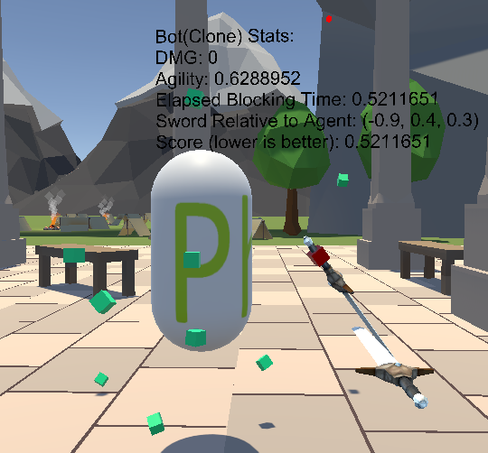
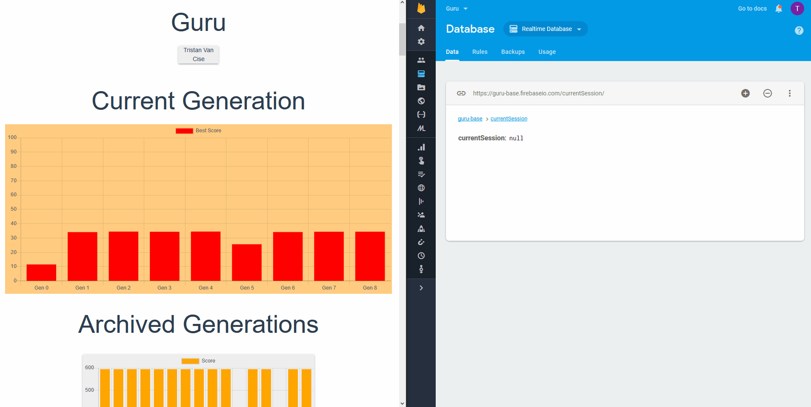
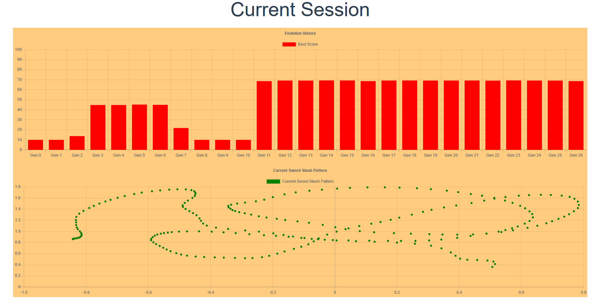
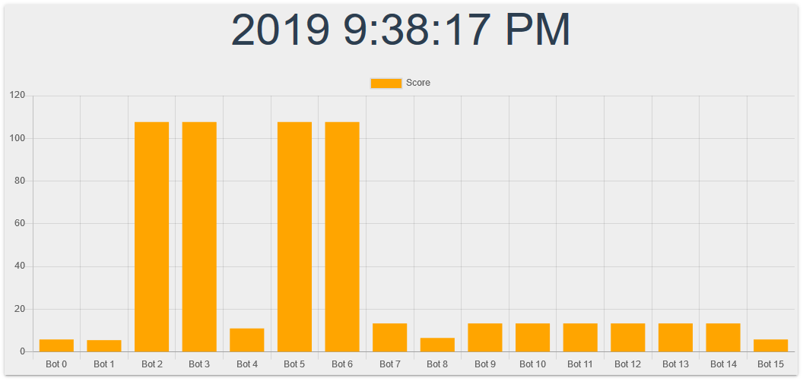

# Guru
Train your VR sword apprentice to be the master of all warriors.

NOTE: This can be played without VR equipment using SteamVR's 2D Debug mode in Unity!
___
## Training

___
## Analysis

___

## Brainstorming
You start in a picturesque dojo, landscape, etc... and perform a move with your sword for your apprentice AI to block, parry, dodge, or counterattack. This move is propagated to a series of generations of the current AI, the best performing move on in an evolutionary fashion until a certain threshold. The trained AI is reported back to the trainer (you) where you can either choose to train the AI more or have it compete against other peoples AI in a global ranking system. Winning matches and training your AI gain point which you can use to buy cosmetic items that alter your AI's appearance and training environment. Support for training multiple AI in squad could be implemented later. Players could train a certain AI for heavy offense, another for nimble combat, and another for absorbing large amounts of damage.

## Theoretical Technical Dependencies
* Unity
  * Sword assets
  * AI character customization
  * Environment assets
  * Marketplace
  * Music
  * AI vs AI combat
  * Leaderboard system

* Tensor Flow (or some other frameworks like a Unity Agent)
* Website
